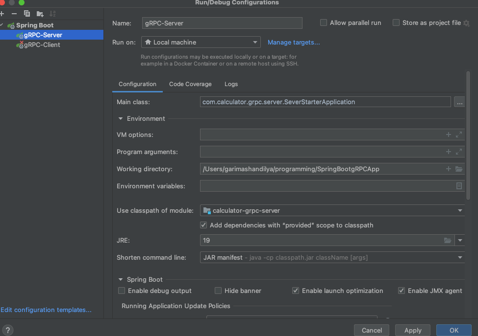

Configure and runs the gRPC server with grpc-spring-boot-starter

https://yidongnan.github.io/grpc-spring-boot-starter/

| Module            | Detail           | 
| ----------------- |:-------------:| 
| calculator-grpc-api      |  contains the  protobuf file(calculation.proto) and generates the java model and service classes | 
| calculator-grpc-client     | client project, uses stubs to call the gRPC server      |  
| calculator-grpc-server| server project, uses stubs to provide the response the client     |

Running the app (gRPC Server Application and gRPC Client Application)

